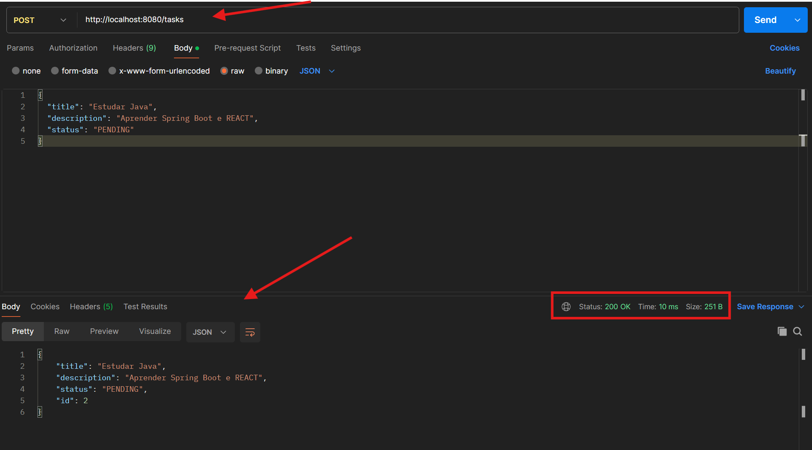
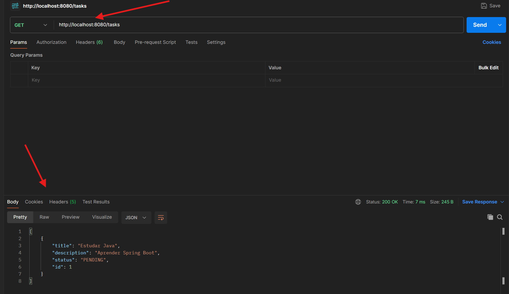

# 🚀 Task Manager API

API REST desenvolvida em Java com Spring Boot para gerenciamento de tarefas, com operações CRUD e aplicação de boas práticas de desenvolvimento backend.

---

## 📌 Sobre o projeto

Este projeto foi desenvolvido com o objetivo de consolidar conhecimentos em desenvolvimento backend utilizando Java e Spring Boot, com foco em:

* Construção de APIs REST
* Organização em camadas (Controller, Service, Repository)
* Aplicação de Programação Orientada a Objetos
* Manipulação de dados com JPA/Hibernate

---

## 🛠️ Tecnologias utilizadas

* Java 17+
* Spring Boot
* Spring Data JPA
* H2 Database
* Maven

---

## 🧠 Conceitos aplicados

* Programação Orientada a Objetos (POO)
* Arquitetura em camadas
* API REST
* CRUD (Create, Read, Update, Delete)
* Integração entre camadas (Controller → Service → Repository)

---

## ⚙️ Como executar o projeto

### Pré-requisitos:

* Java 17+
* Maven (ou usar o wrapper do projeto)

### Passos:

```bash
# Clonar o repositório
git clone https://github.com/laurarrmuniz/task-manager-api.git

# Entrar na pasta
cd task-manager-api

# Rodar a aplicação
./mvnw spring-boot:run
```

A aplicação estará disponível em:

```
http://localhost:8080
```

---

## 🔗 Endpoints

### 📍 Criar tarefa

POST /tasks

```json
{
  "title": "Estudar Java",
  "description": "Praticar API REST",
  "status": "PENDING"
}
```

---

### 📍 Listar tarefas

GET /tasks

---

### 📍 Buscar por ID

GET /tasks/{id}

---

### 📍 Atualizar tarefa

PUT /tasks/{id}

---

### 📍 Deletar tarefa

DELETE /tasks/{id}

---

## 📚 Documentação da API

A documentação interativa da API pode ser acessada via Swagger:

http://localhost:8080/swagger-ui.html

Permite visualizar e testar todos os endpoints diretamente pelo navegador.

---

## 📸 Exemplos de uso

### Criando uma tarefa


### Listando tarefas


---

## 🗄️ Banco de dados

O projeto utiliza o banco em memória H2 para facilitar testes e execução local.

Console disponível em:

```
http://localhost:8080/h2-console
```

---

## 🎯 Objetivo

Este projeto foi desenvolvido com foco em aprendizado e prática de desenvolvimento backend, buscando simular cenários reais de construção de APIs utilizadas em sistemas corporativos.

---

## 🚀 Próximas melhorias

* Implementação de validações (Bean Validation)
* Integração com banco PostgreSQL
* Autenticação e autorização (Spring Security)
* Testes automatizados

---

## 👩‍💻 Autora

Laura Muniz
📍 Uberlândia - MG
🔗 https://github.com/laurarrmuniz
🔗 https://www.linkedin.com/in/laura-rr-muniz/
